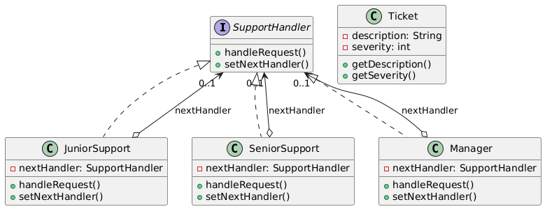

# 🔗 Chain of Responsibility Design Pattern

The **Chain of Responsibility Pattern** is a behavioral design pattern that passes a request along a chain of handlers
until
one handles it or the chain ends. It’s like a customer service hotline where your call is passed from one agent to the
next until someone resolves your issue.

---

## 📑 Table of Contents

1. [✅ Definition](#-definition)
2. [🤔 Intuition](#-intuition)
3. [📌 Use Cases](#-use-cases)
4. [🧠 Key Concepts](#-key-concepts)
5. [📊 UML Diagram](#-uml-diagram)
6. [🎯 Advantages & Disadvantages](#-advantages--disadvantages)

---

## ✅ Definition

The Chain of Responsibility Pattern allows a request to be passed through a chain of handlers, where each handler
decides whether to process the request or pass it to the next handler. This decouples the sender from the receiver,
providing flexibility in handling requests.

* **Category:** Behavioral Pattern
* **Purpose:** Enable dynamic request handling by organizing handlers in a chain.

---

## 🤔 Intuition

Imagine a support ticket system where a ticket is first handled by a junior support agent. If they can’t resolve it,
they escalate it to a senior agent, and if needed, to a manager. Each handler checks if they can process the request; if
not, they pass it along. The Chain of Responsibility Pattern works similarly: requests flow through a chain of objects
until one handles it or the chain ends.

---

## 📌 Use Cases

The Chain of Responsibility Pattern is ideal when:

* Multiple objects might handle a request, and the handler isn’t known in advance.
* You want to decouple the sender of a request from its receivers.
* Handlers need to be processed in a specific order, with the option to stop at any point.
* Examples:
    * Event Handling in GUI: Mouse clicks or keyboard events passed through UI components.
    * Logging Systems: Log messages processed by different loggers based on severity (e.g., debug, error).
    * Request Pipelines: Middleware in web frameworks (e.g., Express.js) processing HTTP requests.

---

## 🧠 Key Concepts

**1. Handler Interface:**

- Defines a method for handling requests and a reference to the next handler in the chain.

**2. Concrete Handler:**

- Implements the handler interface, processing the request or passing it to the next handler.

**3. Client:**

- Initiates the request and sends it to the first handler in the chain.

**4. Chain Structure:**

- Handlers are linked sequentially, typically using a reference to the next handler.

**5. Decoupling:**

- The sender doesn’t need to know which handler processes the request, promoting loose coupling.

---

## 📊 UML Diagram

 

---

## 🎯 Advantages & Disadvantages

### Advantages

* Decouples sender from receiver, allowing dynamic handler assignment.
* Flexible chain structure, easy to add or reorder handlers.
* Promotes Single Responsibility Principle by distributing tasks.

### Disadvantages

* Request may go unhandled if no handler is suitable.
* Can lead to long chains, impacting performance.
* Debugging can be tricky if the chain is complex.