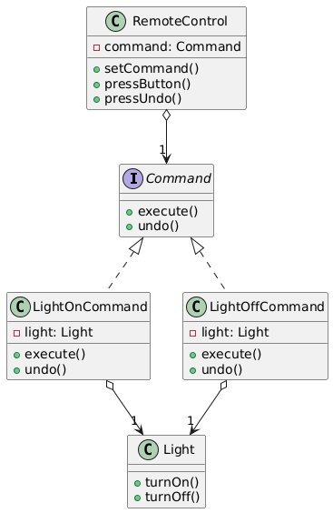

# 📜 Command Design Pattern

The **Command Design Pattern** is a behavioral design pattern that encapsulates a request as an object, thereby allowing
parameterization of clients with different requests, queuing of requests, and support for undoable operations. It’s like
a restaurant order slip that contains all the details needed to execute a customer’s request.

---

## 📑 Table of Contents

1. [✅ Definition](#-definition)
2. [🤔 Intuition](#-intuition)
3. [📌 Use Cases](#-use-cases)
4. [🧠 Key Concepts](#-key-concepts)
5. [📊 UML Diagram](#-uml-diagram)
6. [🎯 Advantages & Disadvantages](#-advantages--disadvantages)

---

## ✅ Definition

The Command Pattern transforms a request into a standalone object that contains all the information about the request,
including the method to call and its parameters. This enables operations like executing, undoing, or queuing requests,
decoupling the invoker from the receiver.

- **Category**: Behavioral Pattern
- **Purpose**: Encapsulate requests as objects to support flexible execution, logging, or reversal of operations.

---

## 🤔 Intuition

Imagine a remote control (the invoker) that sends commands to a TV (the receiver). Each button press is a command
object (e.g., "turn on" or "change channel") that contains the action and parameters. The remote doesn’t need to know
how the TV works; it just sends the command. The Command Pattern works similarly: it packages requests as objects,
allowing flexible execution and additional features like undo or logging.

---

## 📌 Use Cases

The Command Pattern is ideal when:

- You need to parameterize objects with operations (e.g., menu actions in a GUI).
- You want to support undo/redo functionality (e.g., text editors).
- You need to queue, log, or schedule operations (e.g., task scheduling in a job queue).
- Examples:
    - **GUI Applications**: Handling button clicks or menu actions (e.g., "Save" or "Undo").
    - **Text Editors**: Implementing commands for cut, copy, paste with undo support.
    - **Task Scheduling**: Queuing tasks in a job processing system.

---

## 🧠 Key Concepts

1. **Command Interface**:
    - Defines a method (e.g., `execute()`) for performing the action.

2. **Concrete Command**:
    - Implements the command interface, specifying the receiver and action to perform.

3. **Invoker**:
    - Triggers the command’s execution, unaware of the receiver’s details.

4. **Receiver**:
    - The object that performs the actual work when the command is executed.

5. **Client**:
    - Creates commands and associates them with receivers, then passes them to the invoker.

6. **Undo/Redo Support** (optional):
    - Commands can include an `undo()` method to reverse actions.

---

## 📊 UML Diagram

 

---

## 🎯 Advantages & Disadvantages

#### Advantages

- Decouples the invoker from the receiver, promoting loose coupling.
- Supports undo/redo operations by storing command state.
- Enables queuing, logging, or scheduling of commands.

#### Disadvantages

- Increases the number of classes, adding complexity.
- May require significant memory for storing command history (e.g., for undo).
- Command objects can become complex if they handle many parameters.
