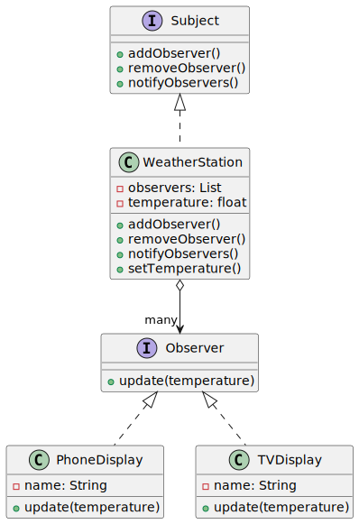

# 👀 Observer Design Pattern

The **Observer Design Pattern** is a behavioral design pattern that defines a one-to-many dependency between objects,
where a change in one object (the subject) notifies all dependent objects (observers) automatically. It’s like a news
agency broadcasting updates to subscribed readers.

---

## 📑 Table of Contents

1. [✅ Definition](#-definition)
2. [🤔 Intuition](#-intuition)
3. [📌 Use Cases](#-use-cases)
4. [🧠 Key Concepts](#-key-concepts)
5. [📊 UML Diagram](#-uml-diagram)
6. [🎯 Advantages & Disadvantages](#-advantages--disadvantages)

---

## ✅ Definition

The Observer Pattern establishes a subscription mechanism where multiple objects (observers) are notified of state
changes in a subject. It enables loose coupling between the subject and its observers, allowing dynamic addition or
removal of observers.

- **Category**: Behavioral Pattern
- **Purpose**: Facilitate communication between a subject and its dependents for automatic updates.

---

## 🤔 Intuition

Imagine a weather station (the subject) that tracks temperature and notifies all subscribed devices (observers) like
phones or displays when the temperature changes. Each device updates its display without the weather station knowing the
details of how they work. The Observer Pattern works similarly: a subject maintains a list of observers and notifies
them of state changes, keeping the system modular.

---

## 📌 Use Cases

The Observer Pattern is ideal when:

- A change in one object requires updating multiple dependent objects.
- You need a publish-subscribe mechanism where subscribers can join or leave dynamically.
- You want to decouple the subject from its observers for flexibility.
- Examples:
    - **Event Handling in GUI**: UI components (e.g., buttons) notifying listeners of clicks.
    - **Real-Time Data Feeds**: Stock market apps notifying subscribers of price changes.
    - **Messaging Systems**: Chat applications broadcasting messages to connected users.

---

## 🧠 Key Concepts

1. **Subject**:
    - Maintains a list of observers and provides methods to add, remove, or notify them.
    - Holds the state that observers are interested in.

2. **Observer Interface**:
    - Defines a method (e.g., `update()`) that observers implement to receive notifications.

3. **Concrete Observers**:
    - Implement the observer interface to handle updates from the subject.

4. **Loose Coupling**:
    - The subject doesn’t need to know the details of observers, only that they implement the observer interface.

5. **Push vs. Pull Model**:
    - **Push**: Subject sends data to observers in the update call.
    - **Pull**: Observers query the subject for data after being notified.

---

## 📊 UML Diagram

 

---

## 🎯 Advantages & Disadvantages

#### Advantages

- Supports dynamic addition/removal of observers.
- Promotes loose coupling between subject and observers.
- Enables broadcast communication to multiple objects.

#### Disadvantages

- Can lead to memory leaks if observers aren’t removed properly.
- Notification overhead may impact performance with many observers.
- Observers may become dependent on the subject’s state in a pull model.