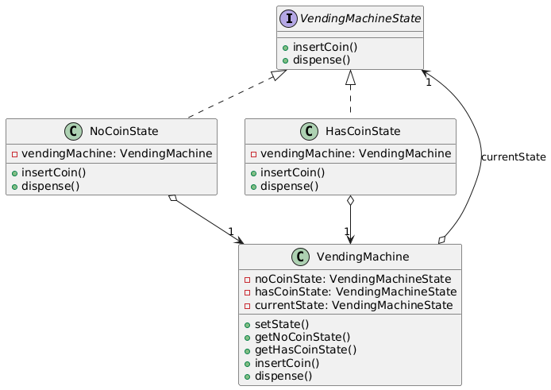

# 🔄 State Design Pattern

The **State Design Pattern** is a behavioral design pattern that allows an object to alter its behavior when its
internal state changes. It’s like a vending machine that behaves differently depending on whether it’s waiting for a
coin, dispensing a product, or out of stock.

---

## 📑 Table of Contents

1. [✅ Definition](#-definition)
2. [🤔 Intuition](#-intuition)
3. [📌 Use Cases](#-use-cases)
4. [🧠 Key Concepts](#-key-concepts)
5. [📊 UML Diagram](#-uml-diagram)
6. [🎯 Advantages & Disadvantages](#-advantages--disadvantages)

---

## ✅ Definition

The State Pattern encapsulates state-specific behavior into separate classes and delegates the behavior to the current
state object. This allows an object to appear as if it changes its class when its state changes, promoting clean and
maintainable code.

- **Category**: Behavioral Pattern
- **Purpose**: Manage state-dependent behavior by encapsulating states as objects.

---

## 🤔 Intuition

Imagine a traffic light that changes its behavior based on its state (red, yellow, green). Instead of using complex
conditionals (e.g., `if-else`) to handle each state, the State Pattern assigns each state (e.g., RedState, GreenState)
its own class with specific behavior. The traffic light delegates actions to the current state, making it easy to add or
modify states without changing the core logic.

---

## 📌 Use Cases

The State Pattern is ideal when:

- An object’s behavior depends on its state, and it must change behavior at runtime.
- You want to avoid large conditional statements for state-dependent logic.
- State transitions are well-defined and need to be managed cleanly.
- Examples:
    - **Vending Machines**: Handling states like "No Coin," "Has Coin," or "Dispensing."
    - **Game Development**: Managing player states (e.g., idle, running, jumping).
    - **Workflow Systems**: Modeling stages in a process (e.g., draft, review, published).

---

## 🧠 Key Concepts

1. **State Interface**:
    - Defines a common interface for all state classes, specifying state-specific behaviors.

2. **Concrete States**:
    - Implement the state interface, defining behavior for a specific state.

3. **Context**:
    - The main object that maintains a reference to the current state and delegates behavior to it.

4. **State Transitions**:
    - The context or state objects manage transitions between states, often via a setter method.

5. **Encapsulation**:
    - Each state encapsulates its behavior, reducing conditionals and improving maintainability.

---

## 📊 UML Diagram

 

---

## 🎯 Advantages & Disadvantages

### Advantages

- Eliminates complex conditional logic for state-dependent behavior.
- Makes state transitions explicit and maintainable.
- Supports adding new states without modifying the context.

### Disadvantages

- Increases the number of classes, adding complexity.
- May be overkill for systems with few or simple states.
- State transitions can become complex if not managed properly.