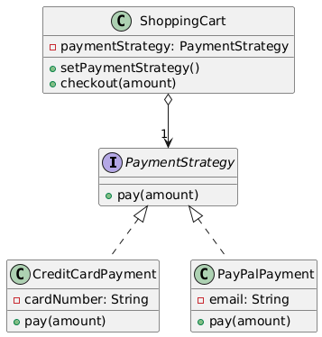

# 🎯 Strategy Design Pattern

The **Strategy Design Pattern** is a behavioral design pattern that enables selecting an algorithm or behavior at
runtime. It encapsulates a family of interchangeable algorithms, allowing a client to switch strategies dynamically
without altering the core logic.

---

## 📋 Table of Contents: Strategy Pattern

1. [✅ Definition](#-definition)
2. [🤔 Intuition](#-intuition)
3. [📌 Use Cases](#-use-cases)
4. [🧠 Key Concepts](#-key-concepts)
5. [📊 UML Diagram](#-uml-diagram)
6. [🎯 Advantages & Disadvantages](#-advantages--disadvantages)

---

## ✅ Definition

The Strategy Pattern defines a family of algorithms, encapsulates each one, and makes them interchangeable. It allows a
client to choose an algorithm from a set of options at runtime, promoting flexibility and reusability.

- **Category**: Behavioral Pattern
- **Purpose**: Enable dynamic selection of algorithms while adhering to the Open/Closed Principle.

---

## 🤔 Intuition

Imagine a navigation app that calculates routes based on user preferences: fastest, shortest, or scenic. Instead of
hardcoding the routing logic, the app uses different strategies (algorithms) for each preference, and you can switch
between them seamlessly. The Strategy Pattern works similarly: it lets you swap out behaviors (strategies) without
changing the main application code.

---

## 📌 Use Cases

The Strategy Pattern is ideal when:

- You need to switch between multiple algorithms or behaviors dynamically.
- You want to avoid conditional statements (e.g., `if-else`) for selecting behavior.
- You need to isolate algorithm logic from the client code for reusability.
- Examples:
    - **Payment Systems**: Choosing payment methods (e.g., Credit Card, PayPal, Crypto).
    - **Sorting Algorithms**: Selecting sorting strategies (e.g., QuickSort, MergeSort) at runtime.
    - **Game AI**: Switching enemy behaviors (e.g., aggressive, defensive) based on game state.

---

## 🧠 Key Concepts

1. **Strategy Interface**:
    - Defines a common interface for all supported algorithms or behaviors.

2. **Concrete Strategies**:
    - Implement the strategy interface, each providing a specific algorithm or behavior.

3. **Context**:
    - The class that uses the strategy, maintaining a reference to a strategy object and invoking its behavior.

4. **Runtime Flexibility**:
    - The context can switch strategies dynamically via a setter method or constructor.

5. **Encapsulation**:
    - Each strategy encapsulates a specific algorithm, making it easy to add or modify behaviors.

---

## 📊 UML Diagram

 

---

## 🎯 Advantages & Disadvantages

#### Advantages

- Promotes flexibility by allowing runtime strategy changes.
- Eliminates conditional logic (e.g., `if-else`) for selecting behaviors.
- Encourages reusability and maintainability of algorithm code.

#### Disadvantages

- Increases the number of classes (one per strategy).
- Clients must be aware of available strategies to select them.
- May add complexity for simple use cases with few strategies.