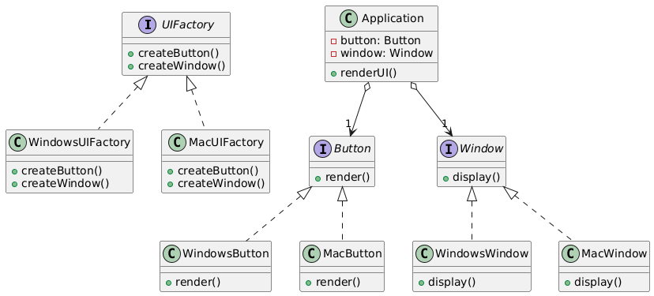

# 🏭 Abstract Factory Design Pattern

The **Abstract Factory Design Pattern** is a creational design pattern that provides a way to create families of related
or dependent objects without specifying their concrete classes. It’s like a factory of factories, producing a set of
objects that work together seamlessly.

---

## 📑 Table of Contents

1. [✅ Definition](#-definition)
2. [🤔 Intuition](#-intuition)
3. [📌 Use Cases](#-use-cases)
4. [🧠 Key Concepts](#-key-concepts)
5. [📊 UML Diagram](#-uml-diagram)
6. [🎯 Advantages & Disadvantages](#-advantages--disadvantages)

---

## ✅ Definition

The Abstract Factory Pattern defines an interface or abstract class for creating families of related objects, allowing
clients to work with different product variants without knowing their concrete implementations. It ensures that the
created objects are compatible with each other.

- **Category**: Creational Pattern
- **Purpose**: Create families of related objects while promoting consistency and loose coupling.

---

## 🤔 Intuition

Imagine a furniture store that sells themed furniture sets (e.g., Modern or Victorian). Instead of picking individual
pieces, you choose a theme, and the store provides a matching set of chairs, tables, and sofas. The Abstract Factory
Pattern works similarly: it provides a factory for each theme (family) that creates related objects, ensuring they fit
together without the client needing to know the details.

---

## 📌 Use Cases

The Abstract Factory Pattern is ideal when:

- A system needs to create families of related objects (e.g., UI components for different operating systems).
- You want to ensure consistency among created objects.
- You need to support multiple product variants without changing client code.
- Examples:
    - **GUI Frameworks**: Creating UI components (e.g., buttons, windows) for Windows or Mac.
    - **Database Drivers**: Providing database access objects (e.g., connection, query) for MySQL or PostgreSQL.
    - **Game Development**: Creating themed assets (e.g., characters, weapons) for different game levels or genres.

---

## 🧠 Key Concepts

1. **Abstract Factory Interface**:
    - Declares methods for creating each type of product in the family.

2. **Concrete Factories**:
    - Implement the abstract factory interface to create specific product families.

3. **Abstract Product Interfaces**:
    - Define interfaces for each type of product in the family.

4. **Concrete Products**:
    - Implement the product interfaces, representing the actual objects created by the factory.

5. **Client**:
    - Uses the abstract factory to create products, working with abstractions rather than concrete classes.

---

## 📊 UML Diagram

 

---

## 🎯 Advantages & Disadvantages

### Advantages

- Ensures consistency among products in a family.
- Supports multiple product variants without changing client code.
- Promotes loose coupling by using abstractions.

### Disadvantages

- Increases complexity with additional interfaces and classes.
- Can be overkill for systems with few product families.
- Adding new products requires modifying the abstract factory interface.