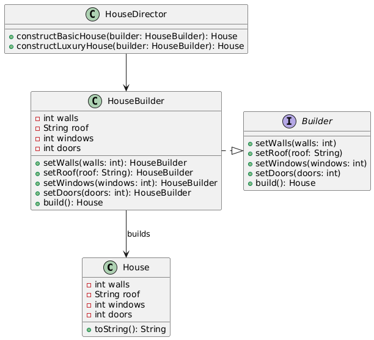

# 🛠️ Builder Pattern

**Builder Pattern** is a creational design pattern that lets you construct complex objects step by step. The pattern
allows you to produce different types and representations of an object using the same construction code

## 📑 Table of Contents

1. [✅ Definition](#-definition)
2. [🤔 Intuition](#-intuition)
3. [📌 Use Cases](#-use-cases)
4. [🧠 Key Concepts](#-key-concepts)
5. [📊 UML Diagram](#-uml-diagram)
6. [🎯 Advantages & Disadvantages](#-advantages--disadvantages)
7. [📚 Further Reading](#-further-reading)

---

## ✅ Definition

**The Builder Pattern** is a **creational design pattern** that allows for the step-by-step construction of complex
objects,separating the construction process from the object’s representation. It is particularly useful when an object
requires many optional parameters or configurations, ensuring flexibility and readability.

Key components of the Builder Pattern:

- **Product:** The complex object being built (e.g., a House with multiple attributes).
- **Builder Interface/Abstract Class:** Defines methods for setting attributes (e.g., setWalls(), setRoof()).
- **Concrete Builder:** Implements the builder interface to construct specific configurations of the product.
- **Director (Optional):** Orchestrates the construction process using a builder instance.
- **Client:** Uses the builder to construct the product.

---

## 🤔 Intuition

- **Idea**: The Builder Pattern separates the construction of a complex object from its final representation, allowing
  the same construction process to create different configurations. Instead of a constructor with many parameters (e.g.,
  `House(walls, roof, windows, doors)`), a builder provides a fluent interface to set attributes step-by-step.
- **Why it Works**: By delegating construction to a separate builder object, it improves code readability, supports
  immutability, and handles optional parameters elegantly. The client specifies only the desired attributes, and the
  builder ensures a valid object is created.
- **Key Insight**: The pattern is ideal for objects with many fields, optional components, or immutable requirements. It
  avoids telescoping constructors (multiple overloaded constructors) and makes the code more maintainable.

---

## 📌 Use Cases

The Builder Pattern is used in:

- **Real-World Applications**:
    - Java libraries like `StringBuilder` (building strings incrementally) or `OkHttpClient.Builder` (configuring HTTP
      clients).
    - Creating immutable objects in frameworks (e.g., Protobuf’s generated builders).
    - Configuring complex entities in software (e.g., database query builders, UI component builders).
- **Algorithm Optimization**:
    - Simplifying object creation in scenarios with many optional parameters (e.g., building a configuration object for
      a machine learning model).
    - Ensuring thread-safety by creating immutable objects in multi-threaded environments.

---

## 🧠 Key Concepts

- **Fluent Interface**: Builder methods return `this` to enable method chaining (e.g.,
  `builder.setWalls(4).setRoof("Tile").build()`).
- **Immutability**: The product is often immutable, with final fields set via the builder, ensuring thread-safety and
  consistency.
- **Separation of Concerns**: The construction logic (builder) is separate from the product’s representation, allowing
  multiple builders for different configurations.
- **Validation**: The `build()` method can enforce constraints (e.g., required fields), ensuring valid objects.
- **Director (Optional)**: Provides predefined construction recipes, reducing client code for common configurations.
- **Comparison with Other Patterns**:
    - Unlike **Factory Pattern**, which focuses on creating objects of different types, Builder focuses on constructing
      a single type with varying configurations.
    - Unlike **Abstract Factory**, which creates families of related objects, Builder constructs one complex object
      step-by-step.

---

## 📊 UML Diagram

**Explanation**:

- **House**: The product with final fields for immutability.
- **Builder**: Interface defining setter methods and `build()`.
- **HouseBuilder**: Concrete builder implementing the `Builder` interface with a fluent interface.
- **HouseDirector**: Optional director orchestrating predefined constructions.
- The `HouseBuilder` creates a `House`, and the `HouseDirector` uses the `HouseBuilder` to construct specific
  configurations.

 

---

## 🎯 Advantages & Disadvantages

### Advantages

- **Readability**: Fluent interface makes object construction intuitive (e.g., `builder.setWalls(4).setRoof("Tile")`).
- **Immutability**: Supports creating immutable objects, enhancing thread-safety and consistency.
- **Flexibility**: Allows constructing objects with varying configurations without multiple constructors.
- **Validation**: The `build()` method can enforce constraints, ensuring valid objects.
- **Separation of Concerns**: Separates construction logic from the product’s representation, improving maintainability.

### Disadvantages

- **Increased Code Complexity**: Requires additional classes (builder, director), increasing code volume.
- **Overhead for Simple Objects**: May be overkill for objects with few attributes or simple construction logic.
- **Maintenance**: Changes to the product’s attributes require updates to the builder and director, increasing
  maintenance effort.
- **Learning Curve**: Developers unfamiliar with the pattern may find it less intuitive than direct constructors.

---

## 📚 Further Reading

- [YouTube | ConceptandCoding | Builder Design Pattern](https://www.youtube.com/watch?v=qOLRxN5eVC0)