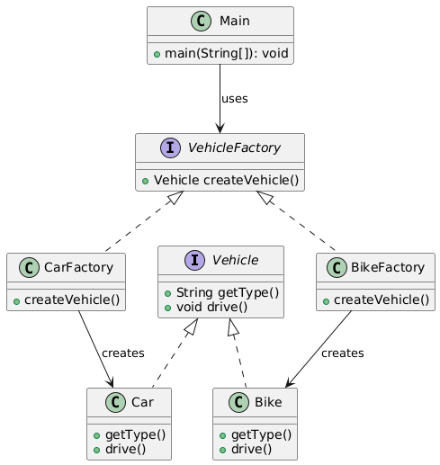

# 🏭 Factory Design Pattern

The **Factory Design Pattern** is a creational design pattern that provides a way to create objects without specifying
their
exact class. It encapsulates object creation logic in a separate "factory" class, making it easier to manage and extend
object instantiation.

---

## 📑 Table of Contents

1. [✅ Definition](#-definition)
2. [🤔 Intuition](#-intuition)
3. [📌 Use Cases](#-use-cases)
4. [🧠 Key Concepts](#-key-concepts)
5. [📊 UML Diagram](#-uml-diagram)
6. [🎯 Advantages & Disadvantages](#-advantages--disadvantages)

---

## ✅ Definition

The Factory Pattern defines an interface or abstract class for creating objects, allowing subclasses or implementations
to decide which class to instantiate. It promotes loose coupling by separating object creation from usage.

- **Category:** Creational Pattern
- **Purpose:** Centralize and abstract object creation to enhance flexibility and scalability.

---

## 🤔 Intuition

Imagine a restaurant kitchen (the factory) that prepares different types of meals based on customer orders. You specify
the type of meal (e.g., pizza, burger), and the kitchen creates it without you needing to know the recipe or
ingredients. The Factory Pattern works similarly: you request an object, and the factory handles the details of creating
the right type.

---

## 📌 Use Cases

The Factory Pattern is useful when:

- You need to create objects based on runtime conditions (e.g., user input or configuration).
- A system must support multiple types of related objects (e.g., different database connectors).
- You want to decouple object creation from the client code.
- Examples:
    - GUI Frameworks: Creating buttons or windows for different operating systems (e.g., Windows vs. Mac).
    - Database Drivers: Instantiating database connectors (e.g., MySQL, PostgreSQL) based on configuration.
    - Game Development: Creating different enemy types (e.g., soldier, tank) based on game level.

---

## 🧠 Key Concepts

1. **Factory Interface/Abstract Class:**
    - Defines a method for creating objects.
    - Clients use this interface to request objects without knowing the concrete class.

2. **Concrete Factory:**
    - Implements the factory interface to create specific objects.
    - Decides which class to instantiate based on input or logic.

3. **Product Interface:**
    - Defines the common interface for objects created by the factory.
    - Ensures all products are interchangeable.

4. **Concrete Product:**
    - The actual objects created by the factory, implementing the product interface.

5. **Loose Coupling:**
    - Clients depend on abstractions (interfaces), not concrete classes, making the system easier to extend.

---

## 📊 UML Diagram

 

---

## 🎯 Advantages & Disadvantages

### Advantages

- Encapsulates object creation, reducing client dependency on concrete classes.
- Simplifies adding new product types without changing client code.
- Promotes the Open/Closed Principle.

### Disadvantages

- Can increase complexity with additional classes for factories.
- May be overkill for simple systems with few object types.