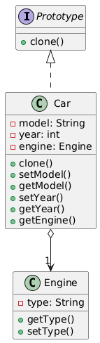

# 🧬 Prototype Design Pattern

The **Prototype Design Pattern** is a creational design pattern that enables the creation of new objects by copying an
existing object, known as the prototype. It’s like cloning a template document to create new documents with similar
structure but customized content.

---

## 📑 Table of Contents

1. [✅ Definition](#-definition)
2. [🤔 Intuition](#-intuition)
3. [📌 Use Cases](#-use-cases)
4. [🧠 Key Concepts](#-key-concepts)
5. [📊 UML Diagram](#-uml-diagram)
6. [🎯 Advantages & Disadvantages](#-advantages--disadvantages)

---

## ✅ Definition

The Prototype Pattern creates new objects by cloning an existing object, avoiding the need to instantiate a class from
scratch. It uses a prototype instance as a template, allowing copies to be modified independently.

- **Category**: Creational Pattern
- **Purpose**: Efficiently create new objects by copying a prototype, especially when object creation is costly or
  complex.

---

## 🤔 Intuition

Imagine a 3D printer creating multiple copies of a model from a single prototype. Each copy can be customized (e.g.,
painted differently), but the base structure comes from the original. The Prototype Pattern works similarly: you create
a prototype object and clone it to produce new objects, saving time and resources compared to creating each object from
scratch.

---

## 📌 Use Cases

The Prototype Pattern is ideal when:

- Object creation is resource-intensive (e.g., involves database queries or complex initialization).
- You need multiple objects with similar properties but slight variations.
- You want to avoid subclassing for creating similar objects.
- Examples:
    - **Document Templates**: Creating multiple documents from a template (e.g., resumes, invoices).
    - **Game Development**: Cloning game objects like enemies or items with shared attributes.
    - **Object Serialization**: Copying objects in systems that support deep cloning.

---

## 🧠 Key Concepts

1. **Prototype Interface**:
    - Declares a method (e.g., `clone()`) for copying the object.

2. **Concrete Prototype**:
    - Implements the clone method to create a copy of itself, either shallow or deep.

3. **Client**:
    - Uses the prototype to create new objects by calling the clone method.

4. **Shallow vs. Deep Copy**:
    - **Shallow Copy**: Copies the object’s fields but shares references to nested objects.
    - **Deep Copy**: Copies the object and all nested objects, ensuring complete independence.

5. **Efficiency**:
    - Reduces the overhead of creating complex objects by reusing a pre-initialized prototype.

---

## 📊 UML Diagram

 

---

## 🎯 Advantages & Disadvantages

### Advantages

- Reduces the cost of creating complex objects by cloning.
- Allows customization of cloned objects without affecting the prototype.
- Simplifies object creation when initialization is expensive.

### Disadvantages

- Deep copying can be complex and error-prone, especially with nested objects.
- Requires careful handling of object references to avoid unintended sharing.
- Cloning may not work well with objects that aren’t designed for it (e.g., final fields).