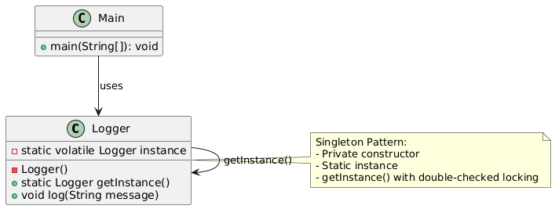

# 🔄 Singleton Design Pattern

The **Singleton Design Pattern** ensures that a class has only one instance and provides a global point of access to it.
It’s like having a single, shared resource, such as a configuration manager, that all parts of an application can use.

---

## 📑 Table of Contents

1. [✅ Definition](#-definition)
2. [🤔 Intuition](#-intuition)
3. [📌 Use Cases](#-use-cases)
4. [🧠 Key Concepts](#-key-concepts)
5. [🔐 Thread Safety & Variants](#-thread-safety--variants)
    - [1. Eager Initialization](#1-eager-initialization)
    - [2. Lazy Initialization (Non-thread-safe)](#2-lazy-initialization-non-thread-safe)
    - [3. Synchronized Method](#3-synchronized-method-thread-safe-but-slow)
    - [4. Double-Checked Locking](#4-double-checked-locking)
    - [5. Bill Pugh Singleton](#5-bill-pugh-singleton-best-practice)
    - [6. Handling Reflection Attacks](#6-handling-reflection-attacks)
    - [7. Enum Singleton](#7-enum-singleton-best-protection)
6. [📊 UML Diagram](#-uml-diagram)
7. [🎯 Advantages & Disadvantages](#-advantages--disadvantages)
8. [📚 Further Reading](#-further-reading)

## ✅ Definition

The Singleton Pattern restricts a class to a single instance and provides a global access point to that instance. It
ensures that only one object of the class is created, often used for managing shared resources or centralized control.

- **Category:** Creational Pattern
- **Purpose:** Control object creation to maintain a single instance and provide global access.

---

## 🤔 Intuition

Initially, we might design a class where each call to getInstance() creates a new object. But that breaks the Singleton
principle.

To fix this:

- We make the constructor private to prevent external instantiation.
- We expose a static method (getInstance()) to provide controlled access.
- We store the instance in a static field, so we return the same instance each time.

---

## 📌 Use Cases

- Configuration classes
- Logging
- Database connections
- Cache or thread pools

---

## 🧠 Key Concepts

- Private constructor
- Static instance variable
- Global access method (usually static)

---

## 🔐 Thread Safety & Variants

### 1. Eager Initialization

- Instance is created at the time of class loading.
- ✅ Thread-safe
- ❌ May create the instance even if it’s never used

```java
public class Singleton {
    private static final Singleton instance = new Singleton();

    private Singleton() {
    }

    public static Singleton getInstance() {
        return instance;
    }
}
```

---

### 2. Lazy Initialization (Non-thread-safe)

- Instance is created only when needed.
- ❌ Not thread-safe — multiple threads could create multiple instances.

```java
public class Singleton {
    private static Singleton instance;

    private Singleton() {
    }

    public static Singleton getInstance() {
        if (instance == null) {
            instance = new Singleton();
        }
        return instance;
    }
}
```

---

### 3. Synchronized Method (Thread-safe but slow)

- Synchronization ensures thread safety.
- ❌ Performance bottleneck — method is synchronized even after instance is created.

```java
  public class Singleton {
    private static Singleton instance;

    private Singleton() {
    }

    public synchronized static Singleton getInstance() {
        if (instance == null) {
            instance = new Singleton();
        }
        return instance;
    }
}
```

---

### 4. Double-Checked Locking

- ✅ Checks if instance is null before and after acquiring the lock.
- ✅ Reduces synchronization overhead.
- ⚠️ Use volatile to ensure visibility across threads.

> volatile ensures that changes made by one thread are visible to others by reading from main memory instead of a
> thread’s local cache.

```java
public class Singleton {
    private static volatile Singleton instance;

    private Singleton() {
    }

    public static Singleton getInstance() {
        if (instance == null) {
            synchronized (Singleton.class) {
                if (instance == null)
                    instance = new Singleton();
            }
        }
        return instance;
    }
}
```

---

### 5. Bill Pugh Singleton (Best Practice)

- Uses a static inner helper class.
- ✅ Thread-safe
- ✅ Lazy-loaded
- ✅ No synchronization overhead

```java
public class Singleton {

    private Singleton() {
    }

    private static class SingletonHelper {
        private static final Singleton INSTANCE = new Singleton();
    }

    public static Singleton getInstance() {
        return SingletonHelper.INSTANCE;
    }
}
```

---

### 6. Handling Reflection Attacks

Reflection can break Singleton by accessing the private constructor. One common mitigation is to throw an exception on
repeated constructor calls:

```java
public class Singleton {
    private static boolean instanceCreated = false;

    private Singleton() {
        if (instanceCreated) {
            throw new RuntimeException("Use getInstance() method");
        }
        instanceCreated = true;
    }

    private static Singleton instance;

    public static Singleton getInstance() {
        if (instance == null) {
            synchronized (Singleton.class) {
                if (instance == null)
                    instance = new Singleton();
            }
        }
        return instance;
    }
}
```

---

### 7. Enum Singleton (Best Protection)

- Java guarantees one instance per enum constant.
- ✅ Reflection and Serialization safe
- ✅ Recommended by Effective Java

```java
public enum Singleton {
    INSTANCE;

    public void someMethod() {
        // logic here
    }
}
```

---

## 📊 UML Diagram

<p align="center">
 
</p>

---

## 🎯 Advantages & Disadvantages

### Advantages

- Ensures a single instance, reducing resource usage.
- Provides a global access point for shared resources.
- Supports lazy initialization for efficiency.

### Disadvantages

- Can introduce global state, making testing and debugging harder.
- Thread safety adds complexity (e.g., synchronization overhead).
- May violate Single Responsibility Principle if the singleton handles multiple tasks.

---

## 📚 Further Reading

- [GeeksForGeeks – Singleton Pattern](https://www.geeksforgeeks.org/system-design/singleton-design-pattern/)
- [YouTube – Singleton in Java by ConceptandCoding](https://www.youtube.com/watch?v=SqDbZOjW1uM)
