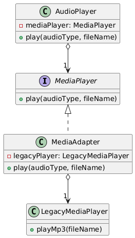

# 🔌 Adapter Design Pattern

The **Adapter Design Pattern** is a structural design pattern that allows incompatible interfaces to work together by
acting as a bridge between them. It’s like a power adapter that lets a US plug work with a European socket.

---

## 📑 Table of Contents

1. [✅ Definition](#-definition)
2. [🤔 Intuition](#-intuition)
3. [📌 Use Cases](#-use-cases)
4. [🧠 Key Concepts](#-key-concepts)
5. [📊 UML Diagram](#-uml-diagram)
6. [🎯 Advantages & Disadvantages](#-advantages--disadvantages)

---

## ✅ Definition

The Adapter Pattern converts the interface of a class into another interface that a client expects. It wraps an existing
class with an incompatible interface, enabling it to work with a system designed for a different interface.

- **Category**: Structural Pattern
- **Purpose**: Enable compatibility between classes with mismatched interfaces.

---

## 🤔 Intuition

Imagine trying to charge your phone with a charger that doesn’t fit the local power outlet. You use an adapter to bridge
the gap between the charger’s plug and the outlet. The Adapter Pattern works similarly: it wraps an incompatible class (
the adaptee) with an adapter that conforms to the expected interface, allowing seamless integration without modifying
the original class.

---

## 📌 Use Cases

The Adapter Pattern is ideal when:

- You need to integrate a legacy system or third-party library with an incompatible interface.
- You want to reuse an existing class without modifying its code.
- Multiple classes with different interfaces need to work with a common system.
- Examples:
    - **Legacy System Integration**: Adapting old database APIs to modern frameworks.
    - **API Wrappers**: Wrapping external APIs (e.g., payment gateways) to match your application’s interface.
    - **GUI Components**: Adapting UI libraries to work with a specific framework.

---

## 🧠 Key Concepts

1. **Target Interface**:
    - The interface that the client expects and interacts with.

2. **Adapter**:
    - A class that implements the target interface and wraps the adaptee, translating calls to the adaptee’s interface.

3. **Adaptee**:
    - The existing class with an incompatible interface that needs adaptation.

4. **Client**:
    - The code that uses the target interface, unaware of the adaptee or adapter.

5. **Object vs. Class Adapter**:
    - **Object Adapter**: Uses composition to hold the adaptee (more flexible).
    - **Class Adapter**: Uses inheritance to extend the adaptee (less common, requires multiple inheritance in some
      languages).

---

## 📊 UML Diagram

 

---

## 🎯 Advantages & Disadvantages

#### Advantages

- Enables reuse of existing classes without modifying their code.
- Promotes loose coupling between client and adaptee.
- Flexible, as adapters can support multiple adaptees or formats.

#### Disadvantages

- Adds complexity with additional classes.
- May require multiple adapters for different adaptees.
- Performance overhead due to the extra layer of indirection.