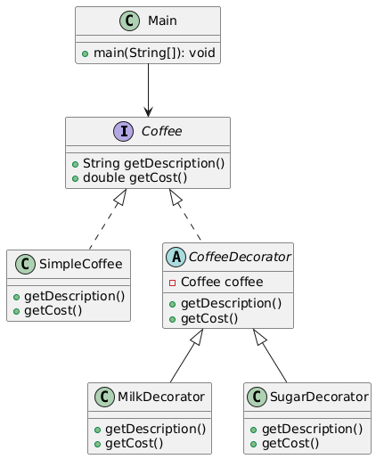

# 🔄 Decorator Design Pattern

The **Decorator Pattern** is a structural design pattern that allows you to dynamically add responsibilities to objects
without modifying their code. It’s like wrapping a gift—adding layers of wrapping paper enhances the gift without
changing what’s inside.
---

## 📑 Table of Contents

1. [✅ Definition](#-definition)
2. [🤔 Intuition](#-intuition)
3. [📌 Use Cases](#-use-cases)
4. [🧠 Key Concepts](#-key-concepts)
5. [📊 UML Diagram](#-uml-diagram)
6. [🎯 Advantages & Disadvantages](#-advantages--disadvantages)

---

## ✅ Definition

The Decorator Pattern attaches additional behaviors or responsibilities to an object by wrapping it with one or more
decorator classes. These decorators conform to the same interface as the original object, enabling flexible and reusable
extensions without altering the core object’s code.

- **Category:** Structural Pattern
- **Purpose:** Extend object functionality dynamically while adhering to the Open/Closed Principle.

---

## 🤔 Intuition

Think of the Decorator Pattern like customizing a coffee order at a café:

- Start with a basic coffee (the core object).
- Add “decorators” like milk, sugar, or whipped cream to enhance it.
- Each decorator adds a feature (e.g., extra cost or flavor) without changing the coffee itself.

The pattern uses a chain of objects that share a common interface, allowing you to stack decorators to combine
behaviors transparently.

---

## 📌 Use Cases

The Decorator Pattern is ideal when you need to:

* Add features to objects dynamically (e.g., adding toppings to a pizza).
* Extend functionality without subclassing (e.g., adding logging or encryption to a stream).
* Support multiple combinations of behaviors (e.g., customizing UI components with borders, scrollbars, or themes).
* Examples:
    * **Java I/O Streams:** BufferedInputStream decorates FileInputStream to add buffering.
    * **UI Frameworks:** Adding scrollbars or borders to windows.
    * **Food Ordering Systems:** Customizing food items with extra ingredients.

---

## 🧠 Key Concepts

1. **Component Interface:**
    - Defines the common interface for the core object and its decorators.
    - Ensures decorators and the original object are interchangeable.

2. **Concrete Component:**
    - The base object to which new behaviors are added.

3. **Decorator Class:**
    - Implements the component interface and contains a reference to a component object.
    - Wraps the component to add new behavior.

4. **Open/Closed Principle:**
    - Decorators allow extending functionality without modifying existing code.

5. **Composition Over Inheritance:**
    - Prefers composition (wrapping objects) over inheritance for flexibility.

---

## 📊 UML Diagram

 

---

## 🎯 Advantages & Disadvantages

### Advantages

- **Flexible:** Add or remove features at runtime.
- **Reusable:** Decorators can wrap multiple components.
- Adheres to Open/Closed Principle.

### Disadvantages

- Can lead to complex object hierarchies with many decorators.
- May increase code complexity for simple use cases.