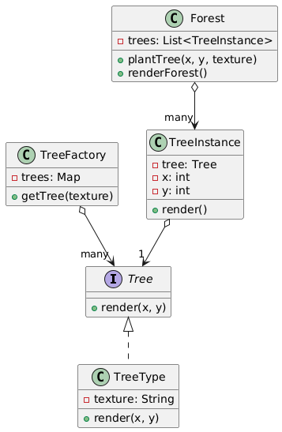

# 🪶 Flyweight Design Pattern

The **Flyweight Design Pattern** is a structural design pattern that minimizes memory usage or computational expenses by
sharing as much data as possible with similar objects. It’s like a library sharing a single copy of a book among
multiple readers instead of duplicating it.

---

## 📑 Table of Contents

1. [✅ Definition](#-definition)
2. [🤔 Intuition](#-intuition)
3. [📌 Use Cases](#-use-cases)
4. [🧠 Key Concepts](#-key-concepts)
5. [📊 UML Diagram](#-uml-diagram)
6. [🎯 Advantages & Disadvantages](#-advantages--disadvantages)

---

## ✅ Definition

The Flyweight Pattern enables efficient sharing of fine-grained objects by separating their intrinsic (shared) and
extrinsic (context-specific) state. It creates a pool of reusable objects to reduce memory usage and improve performance
when dealing with large numbers of similar objects.

- **Category**: Structural Pattern
- **Purpose**: Optimize resource usage by sharing common object data.

---

## 🤔 Intuition

Imagine a text editor rendering thousands of characters on the screen. Instead of creating a new object for each
character (with font, size, etc.), the editor reuses a shared character object for each letter type (e.g., 'A') and
stores unique data (e.g., position) separately. The Flyweight Pattern works similarly: it shares immutable, intrinsic
state across objects and passes extrinsic state as needed, reducing memory overhead.

---

## 📌 Use Cases

The Flyweight Pattern is ideal when:

- A system has a large number of similar objects consuming significant memory.
- Objects can be divided into intrinsic (shared) and extrinsic (unique) state.
- You want to improve performance by reducing object creation and memory usage.
- Examples:
    - **Text Editors**: Managing character or glyph objects with shared font data.
    - **Game Development**: Rendering multiple instances of objects like trees or enemies with shared textures.
    - **Caching Systems**: Reusing database connection objects or pooled resources.

---

## 🧠 Key Concepts

1. **Flyweight Interface**:
    - Defines the interface for flyweight objects, including methods that accept extrinsic state.

2. **Concrete Flyweight**:
    - Implements the flyweight interface, storing intrinsic state and handling operations with extrinsic state.

3. **Flyweight Factory**:
    - Manages a pool of flyweight objects, ensuring they are shared and reused.

4. **Intrinsic vs. Extrinsic State**:
    - **Intrinsic State**: Shared data stored in the flyweight (e.g., character type).
    - **Extrinsic State**: Unique data passed at runtime (e.g., position or color).

5. **Client**:
    - Uses the flyweight factory to obtain flyweights and provides extrinsic state when needed.

---

## 📊 UML Diagram

 

---

## 🎯 Advantages & Disadvantages

#### Advantages

- Reduces memory usage by sharing common object data.
- Improves performance when dealing with many similar objects.
- Separates intrinsic and extrinsic state for cleaner design.

#### Disadvantages

- Increases complexity with additional classes and state management.
- Extrinsic state management can be cumbersome for clients.
- May introduce thread-safety issues when sharing flyweights in concurrent systems.